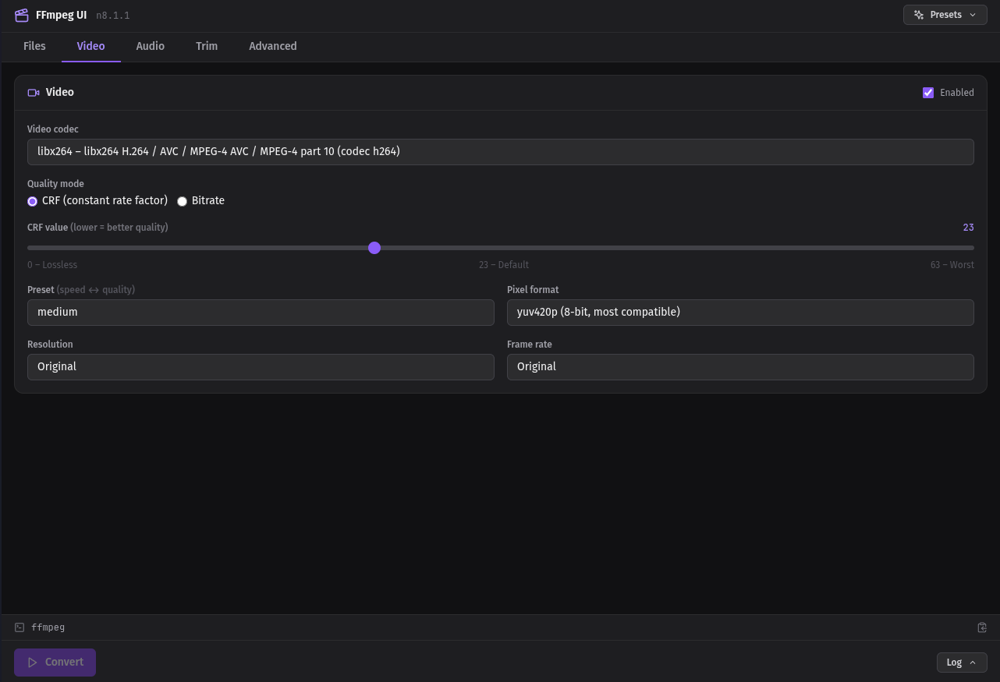

# FFmpeg UI

A modern, feature-rich FFmpeg GUI wrapper built with **Electron + Vite + React + Tailwind CSS**.



## Features

- 🎬 **All FFmpeg codecs** — dynamically loads all encoders from your installed ffmpeg
- 🎵 **Video & Audio** — full codec, bitrate, CRF, preset, resolution, fps, pixel format control
- ✂️ **Trim / Cut** — precise time-based trimming with fast or frame-accurate seek
- ⚡ **Hardware acceleration** — NVENC, VAAPI, QSV, AMF and more
- 📊 **Real-time progress** — frame, fps, size, bitrate, speed
- 📋 **Command preview** — see and copy the exact ffmpeg command being run
- 📂 **Media info** — ffprobe integration shows codec, resolution, fps, etc.
- 🎛️ **Presets** — one-click profiles for Web H.264, HEVC, VP9/AV1, audio extraction, GIF...
- 🖥️ **Log viewer** — syntax-highlighted ffmpeg output

## Requirements

- **ffmpeg** + **ffprobe** in your `PATH`
- **yt-dlp** for YouTube and social-media URLs; direct HTTP, HTTPS, and HLS links work without it
- Node.js >= 18 for development

## Install On Arch Linux

Install from the AUR with your preferred helper:

```bash
yay -S ffmpeg-ui
```

or:

```bash
paru -S ffmpeg-ui
```

Manual AUR install:

```bash
git clone https://aur.archlinux.org/ffmpeg-ui.git
cd ffmpeg-ui
makepkg -si
```

The AUR package uses Arch's system Electron package, depends on `ffmpeg`, and lists `yt-dlp` as an optional dependency for web-video extraction.

## Development

```bash
npm install
npm run dev
```

## Build

```bash
npm run build
npm run build:linux
```

The release files end up in the `release/` directory.

## Maintainer Release

After bumping `package.json`, `package-lock.json`, `PKGBUILD`, and `.SRCINFO`, commit the changes, make sure the AUR checkout is at `./ffmpeg-ui`, then run:

```bash
./scripts/release-aur.sh
```

The script tags the current commit, pushes the branch and tag to GitHub, copies `PKGBUILD` and `.SRCINFO` into `./ffmpeg-ui`, then commits and pushes the AUR update.

## License

GPL-3.0
